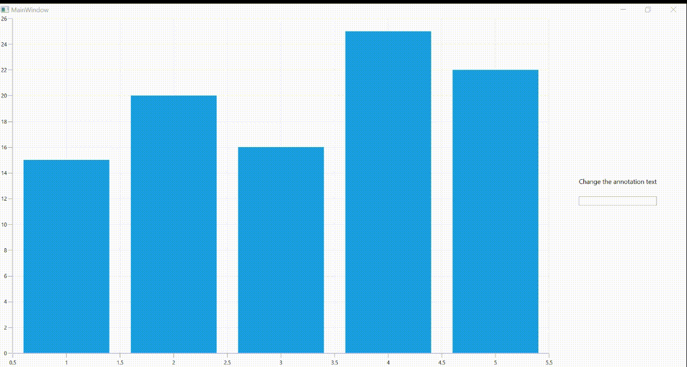

# How to auto fit the text of rectangle annotation in WPF Charts
This article explains how to auto resize [rectangle annotation](https://help.syncfusion.com/wpf/charts/annotations#rectangle-annotation) text in [WPF Chart](https://www.syncfusion.com/wpf-controls/charts).

For more reference, please refer this KB [link](https://www.syncfusion.com/kb/12283/?utm_medium=listing&utm_source=github-examples) 

Consider the use case to dynamically change the annotation text and desired to adjust annotation based on dynamically applied text as per in below

 

This has been achieved by changing the adjusted values X2 and Y2 values of annotation based on the measured applied text from TextBox to annotation as per in below code snippet

XAML

```
  <Grid x:Name="grid">
        <Grid.DataContext>
            <local:ViewModel/>
        </Grid.DataContext>
        <Grid.ColumnDefinitions>
            <ColumnDefinition Width="80*"/>
            <ColumnDefinition Width="20*"/>
        </Grid.ColumnDefinitions>

        <chart:SfChart x:Name="chart">
            <chart:SfChart.PrimaryAxis>
                <chart:NumericalAxis x:Name="xAxis"/>
            </chart:SfChart.PrimaryAxis>

            <chart:SfChart.SecondaryAxis>
                <chart:NumericalAxis x:Name="yAxis" />
            </chart:SfChart.SecondaryAxis>

            <chart:ColumnSeries 
                ItemsSource="{Binding Collection}" 
                XBindingPath="XValue" 
                YBindingPath="YValue"/>
            <chart:SfChart.Annotations>
                <!--Text of rectangle annotation has been updated from TextBox-->
                <chart:RectangleAnnotation  
                    x:Name="annotation"
                    HorizontalTextAlignment="Stretch"
                    VerticalTextAlignment="Stretch"
                    X1="2.5"
                    Text="{Binding Source={x:Reference txtBlock},Path=Text}"
                    Y1="22"
                    ClipToBounds="True"/>
            </chart:SfChart.Annotations>
        </chart:SfChart>

        <StackPanel Orientation="Vertical" Grid.Column="1" HorizontalAlignment="Center" VerticalAlignment="Center" >
            <TextBlock Text="Change the annotation text" Margin="0,0,0,20" HorizontalAlignment="Center" VerticalAlignment="Center"/>
            <!--TextChanged event hook for updating its annotation X2,Y2 on every text changes-->
            <TextBox x:Name="txtBlock" TextChanged="txtBlock_TextChanged" />
        </StackPanel>
    </Grid>
```
[C#]

```
private Size MeasuringString(string text)
        {
            if (string.IsNullOrEmpty(text))
            {
                return new Size(0, 0);
            }

            var TextBlock = new TextBlock()
            {
                Text = text,
                FontWeight = FontWeights.Bold,
            };

            TextBlock.Measure(new Size(Double.PositiveInfinity, Double.PositiveInfinity));
            return new Size(TextBlock.DesiredSize.Width, TextBlock.DesiredSize.Height);
        }

        private void UpdateAnnotation()
        {
            //Measured size from updated text of Textblock
            Size desireSize = MeasuringString(txtBlock.Text);
            var point1 = chart.ValueToPoint(xAxis, Convert.ToDouble(annotation.X1));
            var point2 = chart.ValueToPoint(yAxis, Convert.ToDouble(annotation.Y1));
            var point3 = point1 + desireSize.Width;
            var point4 = point2 + desireSize.Height;
            Point x2Points = new Point(point3, point4);
            var x2 = chart.PointToValue(chart.PrimaryAxis, x2Points);
            var y2 = chart.PointToValue(chart.SecondaryAxis, x2Points);
            annotation.X2 = x2;
            annotation.Y2 = y2;
        }


        private void txtBlock_TextChanged(object sender, TextChangedEventArgs e)
        {
            UpdateAnnotation();
        }
```

# See also

[How to position the annotation based on pixel in WPF Chart](https://help.syncfusion.com/wpf/charts/annotations#positioning-the-annotation)

[How to show the tooltip on annotation in WPF Chart](https://help.syncfusion.com/wpf/charts/annotations#tooltip)

[How to add image in WPF Chart annotation](https://help.syncfusion.com/wpf/charts/annotations#image-annotation)


